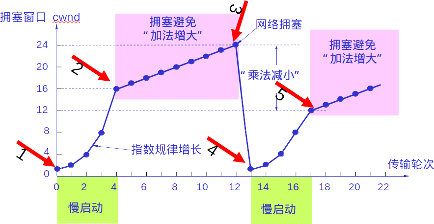

##### 线程

```
状态：就绪  等待 运行   

多线程共享数据区，加锁

加锁策略  资源的hascode 大小比较
```


##### TCP

```
3次握手   最终目的使双方确认对方和自己的数据传输能力正常

第一次  发送方发送报文给收件方   收件方确认发件方发件能力和自己的收件能力

第二次  收件方发送确认报文给发件方  发件方确认收件方的收件能力和发件能力  发件方确认自己的发件和收件能力

第三次 发件方发送确认报文到收件方  收件方确认发件方的收件能力和自己的发件能力

发件方开始数据传输
```

```
ack  确认顺序

发：收到最大的ack 表明之前的数据包都正常收到
收：只发送当前序列最大的ack确认码

滑动窗口协议  确保批量发送数据包对方能接收
超时重传  多次确认

```

<!--more-->



```
快速重传和恢复
收件方收到失序报文马上发送失序之前的最大报文的ack
发件方收到3次重复的ack 立即减半  但是不执行慢启动
减半之后采用拥塞避免算法
```


##### CPU

```
开机
bios 引导
设备检查  中断向量表
加载硬盘操作系统扇区
操作系统接管资源


DMA
数据搬运到内存用不经过cpu机械的复制，cpu解放出来执行其他指令，硬盘数据直接通过总线写入到内存，然后发送中断信号给cpu,避免浪费cpu

缓存
时间局部性  最近被用到的东西可能会再次被用到
空间局部性  附近被用到的东西可能会被再次用到

流水指令
```


##### 进程

```
对一个正在运行的程序的抽象

批处理系统  每次独立使用资源，直到结束 不用进程切换。好处：独立使用资源，不用考虑切换带来的开销，内存分配管理。缺点：遇到IO，cpu会空闲

多道程序 
PCB 进程管理控制快  进程切换 还原指令 寄存器
MMU 内存管理单元 地址重定位  动态重定位

分时系统  
根据进程权重分配时间片

内存管理
分块装入 虚拟内存分页管理  局部性原理  缺页处理  4k对齐
```

##### 线程

```
单核实质还是单条流水线处理
跟进程的区别 
进程都是对资源的抽象描述，进程之间数据不共享，线程之间共享地址空间，全局变量，文件源等。所以在对共享区的数据操作时，线程可以避免io带来的顿卡。线程会带来上下文切换消耗
```

##### 硬盘

```
速度慢  断电不影响  容量大
受限于基础材料，多级缓存
```

##### 文件

```
分散存储  
索引查询
数据块 直接存放数据
间接块 存放其他数据块的盘号
日志文件系统   undo日志确保日志可重复操作 
bitmap 管理磁盘块
```

##### 设备

```
总线
内存映射IO
轮询  主动询问  浪费资源cpu算力，占用总线
中断信号  中断控制器
```


##### 数据库

```
并发操作  行锁
原子性问题  事务   undo日志  幂等性
```

##### 编译

```
源文件  词法分析  语法分析 语义分析  中间代码  代码优化 代码生成
```

##### 分布式事务

```
两段提交  强一致性  只要有网络就会遇到延迟丢失的情况
最终一致性
base模型
柔性事务TCC
```


不能确保扣除操作和写入消息队列操作原子性


定时程序在扫描消息 写入队列 修改消息状态  这里不需要确保事务

消费端需要记录当前消息是否被消费  确保幂等性


```
正交性 变化被封装在一个维度上，可以把这些概念任意组合

```


##### 锁

```
互斥锁  
compare and swap  cas  无锁编程
阻塞后激活开销很大
version
```


##### AOP

```
切面编程
编译植入
动态代理
```

